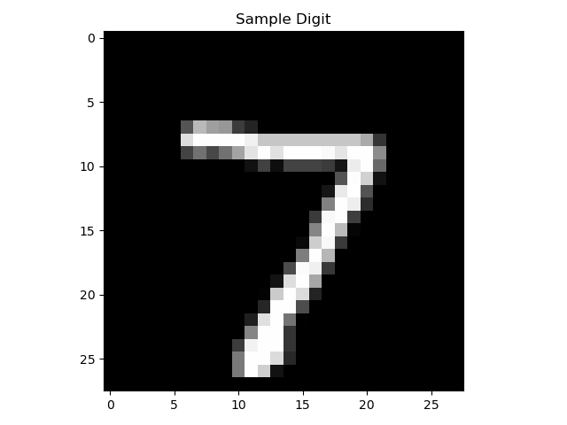

<h1> Handwritten Digit Recognition using Deep Learning</h1>
  
A Deep Learning project to classify handwritten digits (0-9) using the MNIST dataset.
   

    
    
    
    
    
  

   
 

  <h2 style="color: #61dafb;"> Project Overview</h2>
  

    This project demonstrates <strong>Handwritten Digit Recognition</strong> using <strong>Deep Learning</strong> with the world-renowned <strong>MNIST dataset</strong>. By leveraging a Neural Network model built with <strong>TensorFlow & Keras</strong>, we can classify handwritten digits (0–9 ) with remarkable accuracy.
  

  

   
 

  <h2 style="color: #a9a9a9;"> What is Deep Learning?</h2>
  <blockquote style="border-left: 4px solid #61dafb; padding-left: 15px; margin: 0; font-style: italic;">
    <strong>Deep Learning</strong> is a subfield of Machine Learning that utilizes <strong>Artificial Neural Networks</strong> with multiple layers to automatically learn complex patterns from data. Unlike traditional programming, these models learn directly from examples such as images, text, or audio.
  </blockquote>
  <h3 style="color: #a9a9a9;"> Purpose of the Project</h3>
  <ul style="list-style-type: disc; margin-left: 20px;">
    <li>Understand the fundamental <strong>Deep Learning workflow</strong>.</li>
    <li>Build and architect a <strong>Neural Network model</strong>.</li>
    <li>Train a model on real-world <strong>image data</strong>.</li>
    <li>Perform automated <strong>digit prediction</strong>.</li>
    <li>Master <strong>image classification</strong> concepts.</li>
  </ul>

   
 

  <h2 style="color: #61dafb;"> Dataset: MNIST</h2>
  

    The MNIST dataset is often referred to as the "Hello World" of Deep Learning. It consists of:
  

  <ul style="list-style-type: disc; margin-left: 20px;">
    <li><strong>60,000</strong> training images.</li>
    <li><strong>10,000</strong> testing images.</li>
    <li>Grayscale images of digits <strong>0–9</strong>.</li>
    <li>Standardized size of <strong>28 × 28 pixels</strong>.</li>
  </ul>

   
 

  <h2 style="color: #a9a9a9;"> Model Architecture</h2>
  

    The Neural Network is designed with a sequential architecture to process image data efficiently:
  

  <table style="width:100%; border-collapse: collapse; margin-top: 15px;">
    <thead>
      <tr style="background-color: #444c56;">
        <th style="padding: 10px; border: 1px solid #555; text-align: left; color: #61dafb;">Layer</th>
        <th style="padding: 10px; border: 1px solid #555; text-align: left; color: #61dafb;">Type</th>
        <th style="padding: 10px; border: 1px solid #555; text-align: left; color: #61dafb;">Description</th>
      </tr>
    </thead>
    <tbody>
      <tr style="background-color: #2f333a;">
        <td style="padding: 10px; border: 1px solid #555;"><strong>Input</strong></td>
        <td style="padding: 10px; border: 1px solid #555;">Input Layer</td>
        <td style="padding: 10px; border: 1px solid #555;">Accepts 28×28 pixel grayscale images</td>
      </tr>
      <tr style="background-color: #2f333a;">
        <td style="padding: 10px; border: 1px solid #555;"><strong>Flatten</strong></td>
        <td style="padding: 10px; border: 1px solid #555;">Flatten Layer</td>
        <td style="padding: 10px; border: 1px solid #555;">Converts 2D image matrix into a 1D vector</td>
      </tr>
      <tr style="background-color: #2f333a;">
        <td style="padding: 10px; border: 1px solid #555;"><strong>Hidden</strong></td>
        <td style="padding: 10px; border: 1px solid #555;">Dense Layer</td>
        <td style="padding: 10px; border: 1px solid #555;">128 neurons with <strong>ReLU</strong> activation</td>
      </tr>
      <tr style="background-color: #2f333a;">
        <td style="padding: 10px; border: 1px solid #555;"><strong>Output</strong></td>
        <td style="padding: 10px; border: 1px solid #555;">Dense Layer</td>
        <td style="padding: 10px; border: 1px solid #555;">10 neurons (0-9 ) with <strong>Softmax</strong> activation</td>
      </tr>
    </tbody>
  </table>

   
 

  <h2 style="color: #61dafb;">Project Workflow</h2>
  <ol style="list-style-type: decimal; margin-left: 20px;">
    <li><strong>Import Libraries</strong>: Loading TensorFlow, NumPy, and Matplotlib.</li>
    <li><strong>Load Dataset</strong>: Fetching the MNIST data directly from Keras.</li>
    <li><strong>Data Normalization</strong>: Scaling pixel values from <code>0–255</code> to <code>0–1</code> for faster convergence.</li>
    <li><strong>Build Model</strong>: Creating a <code>Sequential</code> deep learning architecture.</li>
    <li><strong>Compile Model</strong>: Using <code>Adam</code> optimizer and <code>Sparse Categorical Crossentropy</code> loss.</li>
    <li><strong>Train Model</strong>: Learning patterns over multiple epochs.</li>
    <li><strong>Evaluate Model</strong>: Testing performance on unseen data.</li>
    <li><strong>Prediction</strong>: Making real-time predictions on test images.</li>
    <li><strong>Visualization</strong>: Displaying results using Matplotlib.</li>
  </ol>

   
 

  <h2 style="color: #a9a9a9;"> Model Performance & Output</h2>
  

    The model achieves high accuracy on handwritten digit classification after training. Below is an example of the model's output:
  

   

    <pre style="color: #e6e6e6; font-family: 'Courier New', Courier, monospace;">
      Test Accuracy:0.9731000065803528
      Predicted Digit: 7
      Actual Digit: 7
    </pre>
  

  

    
  

  

    <em>The image above illustrates a sample prediction, showing the predicted digit and the actual digit.</em>
  

   
 

  <h2 style="color: #61dafb;"> Applications</h2>
  <ul style="list-style-type: disc; margin-left: 20px;">
    <li> <strong>Bank Cheque Processing</strong></li>
    <li><strong>Postal Code Recognition</strong></li>
    <li> <strong>Document Digitization</strong></li>
    <li> <strong>Automatic Form Reading</strong></li>
    <li> <strong>Optical Character Recognition (OCR)</strong></li>
  </ul>

   
 

  <h2 style="color: #a9a9a9;">How to Run</h2>
  

    To get started with this project, follow these simple steps:
  

  <ol style="list-style-type: decimal; margin-left: 20px;">
    <li><strong>Install Dependencies</strong>:
      <pre style="background-color: #2f333a; padding: 10px; border-radius: 5px; color: #e6e6e6; font-family: 'Courier New', Courier, monospace;">pip install tensorflow numpy matplotlib</pre>
    </li>
    <li><strong>Execute the Script</strong>:
      <pre style="background-color: #2f333a; padding: 10px; border-radius: 5px; color: #e6e6e6; font-family: 'Courier New', Courier, monospace;">python digit_recognition.py</pre>
    </li>
  </ol>

   
 

  
  
Author: Sonia Thakur

    
Email: soniathakur7298@gmail.com

